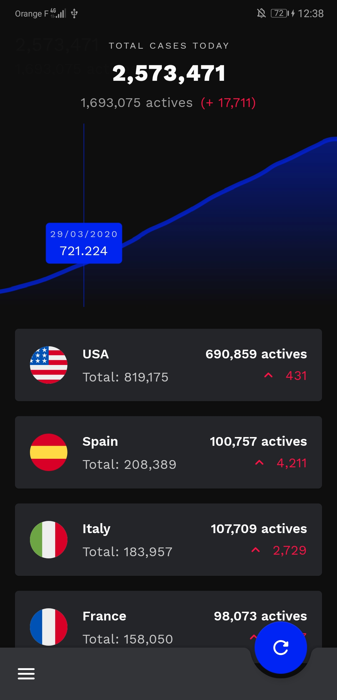

# Covid Update
A mobile application which uses Covid-19 free API to provides daily updates on covid-19.
It is based on clean architecture & Android Architecture components (ViewModel, Livedata) and
coroutines.

</img>
</img>

## Technologies & pattern
* Kotlin
* AndroidX
* Clean Architecture
* Android Architecture Components - ViewModel, LiveData, Room, Paging
* Retrofit - Http client
* Gson - Serialization & deserialization
* Coroutine - Asynchronous and non-blocking programming
* Coil - Image loading
* KoTest - Testing
* Mockito - Mocking
* Koin - Dependency injection
* MPAndroidChart - Chart views

## State
WIP

## Todo
* Clean flags
* update viewModel tests

## Licence
```
Copyright 2020 Gauvain Seigneur

Licensed under the Apache License, Version 2.0 (the "License");
you may not use this file except in compliance with the License.
You may obtain a copy of the License at

   http://www.apache.org/licenses/LICENSE-2.0

Unless required by applicable law or agreed to in writing, software
distributed under the License is distributed on an "AS IS" BASIS,
WITHOUT WARRANTIES OR CONDITIONS OF ANY KIND, either express or implied.
See the License for the specific language governing permissions and
limitations under the License.
```